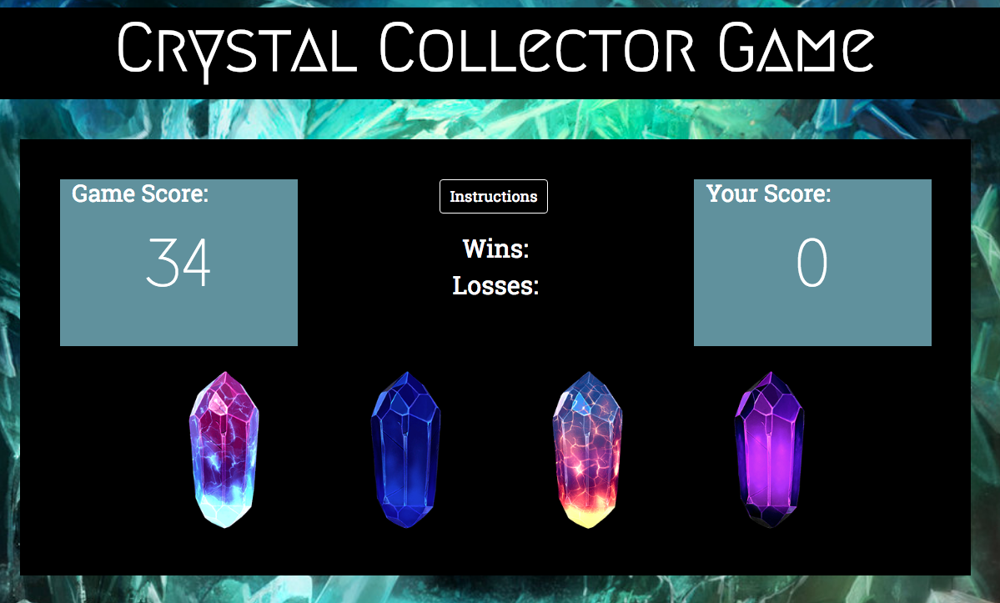

## Crystal-Collector-Game
Description: A game that displays a score that the user has to match by clicking the 4 crystals. Each crystal adds a random value to the user score.

Directions: Each round, the Game Score and each of the 4 crystals get random values. Pressing each crystal will add that random value to Your Score. To get a point, you must get Your Score to equal the Game Score but, going over the Game Score will make you lose.

______________
______________
______________
## Visit the deployed version of Crystal-Collector-Game
[Crystal Collector Game](https://oserenchenko.github.io/Crystal-Collector-Game/)



______________
______________
______________

## Getting Started
to install locally run this command in your terminal
```
git clone https://github.com/oserenchenko/Crystal-Collector-Game.git
```
once inside Crystal-Collector-Game folder, open the index.html in your preferred web browser

## Built With
* HTML - website structure
* [CSS](https://css-tricks.com/) - styling
* [Bootstrap](https://getbootstrap.com/) - styling framework
* [Javascript](https://www.javascript.com/) - website logic
* [jQuery](https://jquery.com/) - manipulating the DOM

______________
______________
______________
## Authors
* [Olga Serenchenko](https://github.com/oserenchenko)

______________
______________
______________
## License
This project is licensed under the MIT License - see the [LICENSE.md](LICENSE.md) file for details
